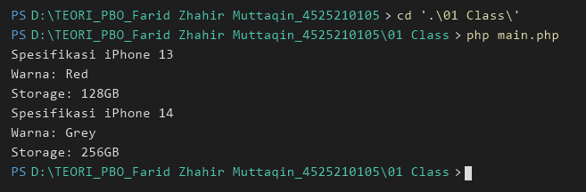
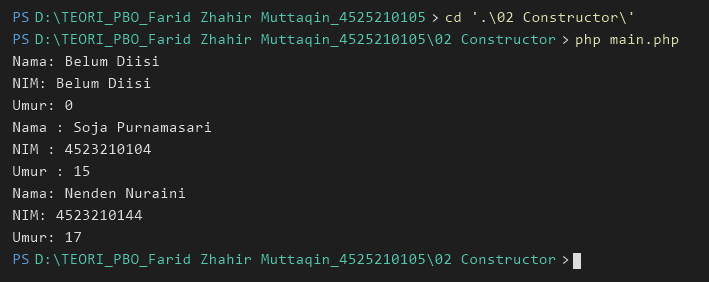
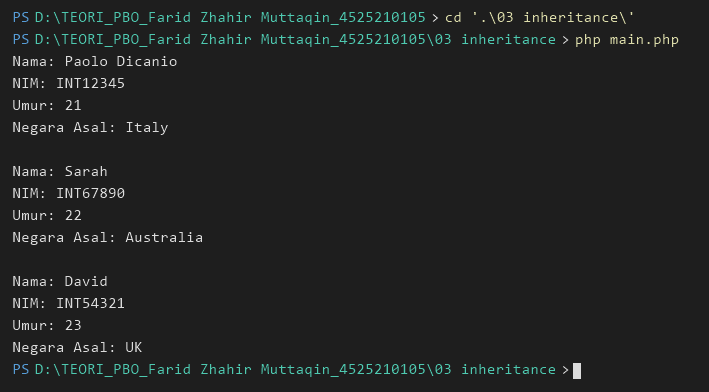
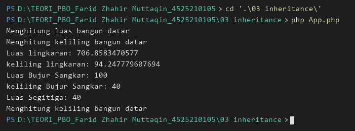
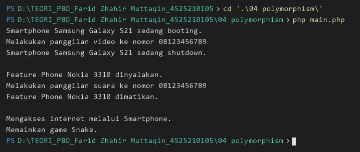
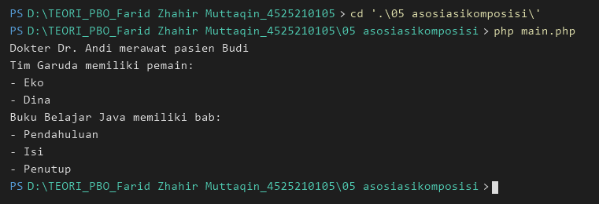
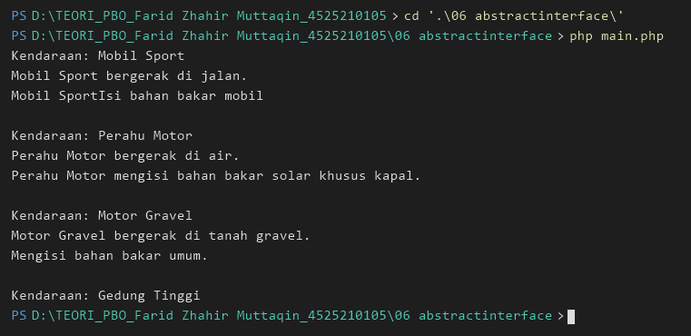

# Tugas 1 PBO: Konversi Java ke PHP


## Daftar Materi

| Pertemuan | Materi | Program PHP |
| --- | --- | --- |
| 01 | Class, object, constructor, dan getter | [`01 Class/`](01%20Class/) |
| 02 | Constructor, getter, dan setter | [`02 Constructor/`](02%20Constructor/) |
| 03 | Inheritance dan overriding | [`03 inheritance/`](03%20inheritance/) |
| 04 | Polymorphism dan overriding method | [`04 polymorphism/`](04%20polymorphism/) |
| 05 | Asosiasi, agregasi, dan komposisi | [`05 asosiasikomposisi/`](05%20asosiasikomposisi/) |
| 06 | Abstract class dan interface | [`06 abstractinterface/`](06%20abstractinterface/) |

## Menjalankan Program

Gunakan PHP 8.0 atau lebih baru dari direktori utama repositori:

```sh
php "01 Class/main.php"
php "02 Constructor/main.php"
php "03 inheritance/main.php"
php "03 inheritance/App.php"
php "04 polymorphism/main.php"
php "05 asosiasikomposisi/main.php"
php "06 abstractinterface/main.php"
```

## Bukti Output

### Pertemuan 01: Class



### Pertemuan 02: Constructor



### Pertemuan 03: Inheritance

Program ini memiliki dua contoh yang dijalankan terpisah.





### Pertemuan 04: Polymorphism



### Pertemuan 05: Asosiasi, Agregasi, dan Komposisi



### Pertemuan 06: Abstract Class dan Interface

